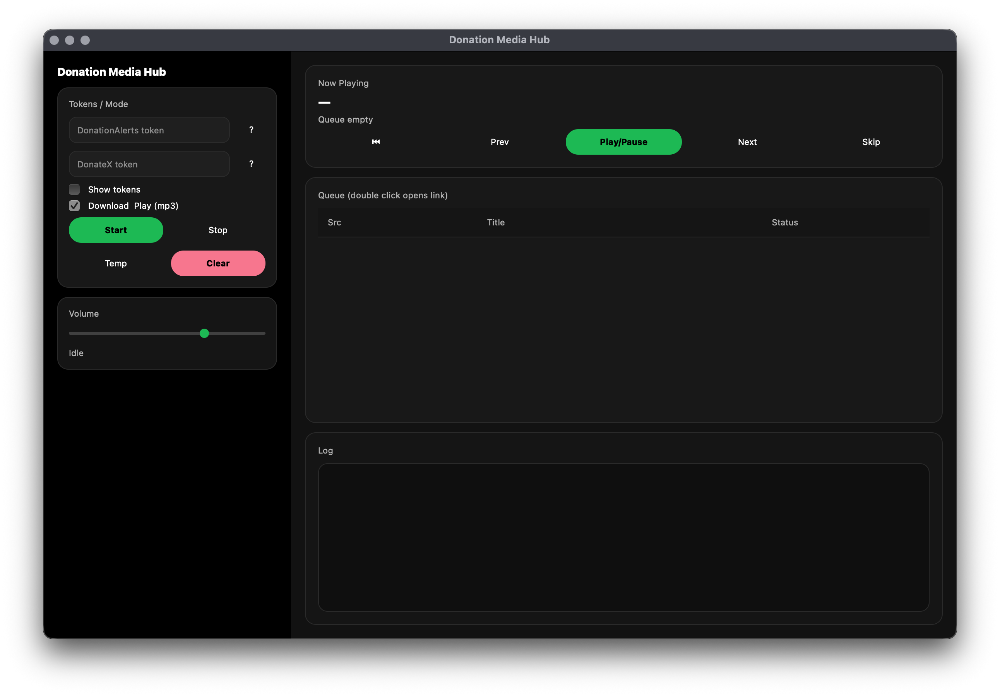

# 🎵 Donation Media Hub

Desktop player for donation music from **DonationAlerts** and **DonateX**  
with automatic **YouTube → MP3** download and playback.



> Clean architecture · Dark UI · Vertical player · Windows & macOS

---

## ✨ Features

- 🎧 Queue-based music player
- 🔄 Auto polling:
  - DonationAlerts (YouTube media)
  - DonateX (musicLink)
- ⬇️ YouTube → MP3 auto-download (via API)
- 🧠 Smart queue trimming (keeps current / prev / next)
- 💾 Persistent state:
  - queue
  - tokens
  - last processed donations
- 🖥️ Builds for **Windows (.exe)**

---

## 🖼️ UI Overview

- **Now Playing** card
- Transport controls:  
  `Start | Prev | Play/Pause | Next | Skip`
- **Queue table** (minimal):
  - `#`
  - `Title`
  - `Status`
- Tokens & settings panel
- Log panel (compact)

---

## 📦 Project Structure

```text
donation-media-hub/
├─ donation_media_hub/
│  ├─ app.py              # App entry (Tk)
│  ├─ config.py           # Constants
│  ├─ paths.py            # Runtime paths (PyInstaller-safe)
│  ├─ models.py           # Track model
│  ├─ queue_manager.py    # Queue logic
│  ├─ downloader.py       # MP3 downloader
│  ├─ playback.py         # pygame audio wrapper
│  ├─ pollers.py          # DA / DX polling threads
│  ├─ storage.py          # JSON load/save
│  ├─ services/           # External APIs
│  └─ ui/                 # UI (theme, dialogs, window)
│
├─ assets/
│  └─ icon.ico
│
├─ .github/workflows/
│  └─ build.yml           # CI builds (macOS + Windows)
│
├─ donation_media_hub.spec
├─ run.py
├─ requirements.txt
└─ README.md
````

---

## 🚀 Quick Start (Dev)

### 1️⃣ Python

Recommended:

```
Python 3.10 – 3.11
```

### 2️⃣ Install dependencies

```bash
pip install -r requirements.txt
```

### 3️⃣ Run app

```bash
python run.py
```

---

## 🔑 Tokens

### DonationAlerts

1. Open:
   [https://www.donationalerts.com/dashboard/general-settings/account](https://www.donationalerts.com/dashboard/general-settings/account)
2. Copy **Secret token**
3. Paste into **DA** field

### DonateX

1. Open:
   [https://donatex.gg/streamer/dashboard](https://donatex.gg/streamer/dashboard)
2. Open donations page
3. In URL find:

   ```
   token=XXXX
   ```
4. Copy `XXXX` into **DX** field

> You can use **only one** service — the other may stay empty.

---

## 🔊 Audio

* Uses **pygame**
* If pygame is missing:

  ```
  pip install pygame
  ```
* If audio init fails, the app will show an error.

---

## 🧹 Temp Files

* MP3 files are stored in OS temp directory:

  ```
  donation_media_hub_tracks/
  ```
* App keeps only:

  * previous
  * current
  * next track
* On exit, user is asked whether to clean temp files.

---

## 🛠️ Build (Local)

### Install PyInstaller

```bash
pip install pyinstaller
```

### Build

```bash
pyinstaller donation_media_hub.spec
```

### Output

| OS      | Result                      |
| ------- | --------------------------- |
| Windows | `dist/DonationMediaHub.exe` |

---

## 🤖 CI / GitHub Actions

This repo includes CI that automatically builds:

* ✅ Windows `.exe`

### Trigger

Push a tag:

```bash
git tag v1.0.0
git push origin v1.0.0
```

Artifacts will appear in **GitHub Actions**.

---

## 🔐 Files NOT committed

These are user-specific and ignored by `.gitignore`:

* `config.json`
* `queue.json`
* `state_donationalerts.json`
* `state_donatex.json`
* downloaded `.mp3`

---

## 🧠 Architecture Principles

* UI ≠ Business logic
* UI does NOT call APIs directly
* Background threads communicate via event queue
* Single responsibility per module
* PyInstaller-safe paths

---

## 📌 Roadmap

* 🔄 Auto-update
* ⌨️ Hotkeys (Space / ← / →)
* 📊 Download progress
* 📦 Windows installer (.msi)
* 🔐 Token encryption

---

## 📜 License

MIT (or choose your own)

---

## ❤️ Author

Built with care for streamers.

Contributions and ideas welcome.

